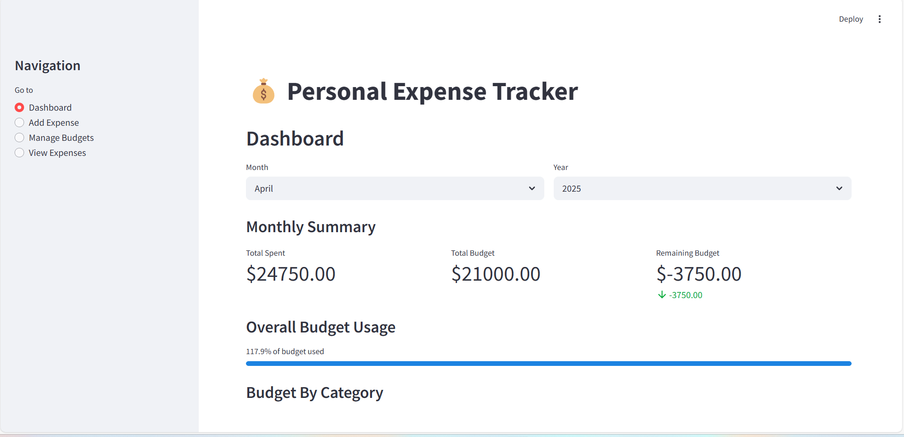
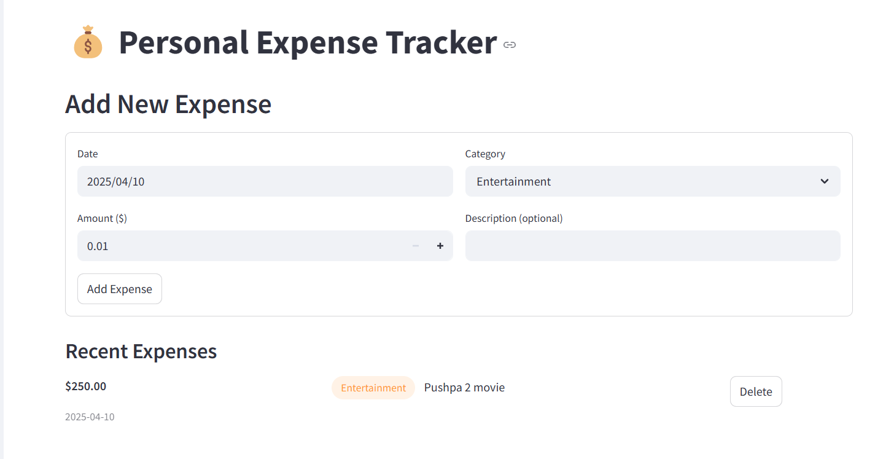

# 💰 Personal Expense Tracker

A full-featured expense tracking application built with FastAPI and Streamlit. This application helps users track their expenses, set budgets, and visualize spending patterns. It features a responsive UI with interactive charts and a **custom budget alert system** that notifies users when they exceed their set budgets.

## 🌟 Features

- **Expense Tracking**: Log daily expenses with categories and descriptions
- **Budget Management**: Set monthly budgets for different expense categories
- **Spending Analytics**: View spending trends and patterns through interactive charts
- **Expense Filtering**: Filter and search through historical expense data
- **Responsive Design**: User-friendly interface that works on all devices

## 🚀 Demo

### Dashboard


### Expense


## 🛠️ Technology Stack

- **Backend**: FastAPI, SQLAlchemy, SQLite
- **Frontend**: Streamlit, Plotly
- **Data Storage**: SQLite database

## 📋 Prerequisites

- Python 3.8 or higher
- pip (Python package manager)

## ⚙️ Installation and Setup

### 1. Clone the repository

```bash
git clone https://github.com/ThanneruTejasri/expense-tracker.git
cd expense-tracker
```

### 2. Set up a virtual environment (optional but recommended)

```bash
# Create virtual environment
python -m venv venv

# Activate virtual environment
# On Windows
venv\Scripts\activate
# On macOS/Linux
source venv/bin/activate
```

### 3. Install dependencies

```bash
pip install -r requirements.txt
```

### 4. Run the backend API

```bash
cd backend
uvicorn main:app --reload
```

The API will be available at http://localhost:8000. You can also access the API documentation at http://localhost:8000/docs.

### 5. Run the frontend application (in a new terminal)

```bash
# Activate virtual environment if you created one
# Navigate to the project root
cd frontend
streamlit run app.py
```

The frontend application will open automatically in your default web browser at http://localhost:8501.

## 🧪 Usage Guide

### Setting Up Budgets

1. Navigate to the "Manage Budgets" page from the sidebar
2. Set monthly budget limits for each expense category
3. Click "Update" to save changes

### Adding Expenses

1. Navigate to the "Add Expense" page from the sidebar
2. Fill in the expense details (amount, category, date, description)
3. Click "Add Expense" to record the expense

### Viewing Analytics

1. Navigate to the "Dashboard" page from the sidebar
2. Use the month and year selectors to filter data
3. Explore the various charts and visualizations

### Filtering Expenses

1. Navigate to the "View Expenses" page from the sidebar
2. Use the filter options to narrow down expenses by date, category, or amount
3. Download filtered data as CSV if needed


## 📞 Contact

Your Name - thannerutejasri1415@gmail.com

Project Link: [https://github.com/ThanneruTejasri/expense-tracker.git](https://github.com/ThanneruTejasri/expense-tracker.git)